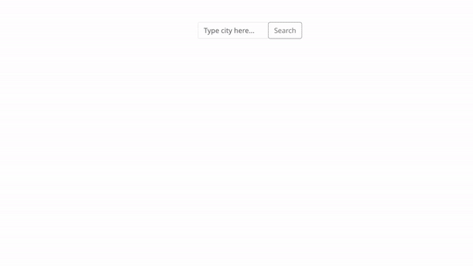

UvIndex is a simple website where you can get the uv index for the next 24 hourse. 
The website run 100% clint side. And uses [Openstreetmap nominatim](https://nominatim.openstreetmap.org/) and [Currentuvindex](https://currentuvindex.com/). 
The website is desing for mobile but it also works on dekstop (but don't look that great i might fix that in the futher).

THis is my first javascript project.
